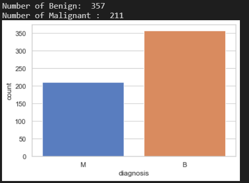
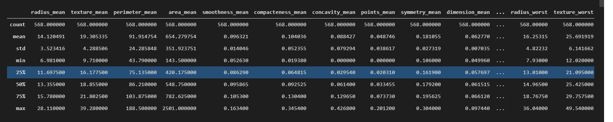
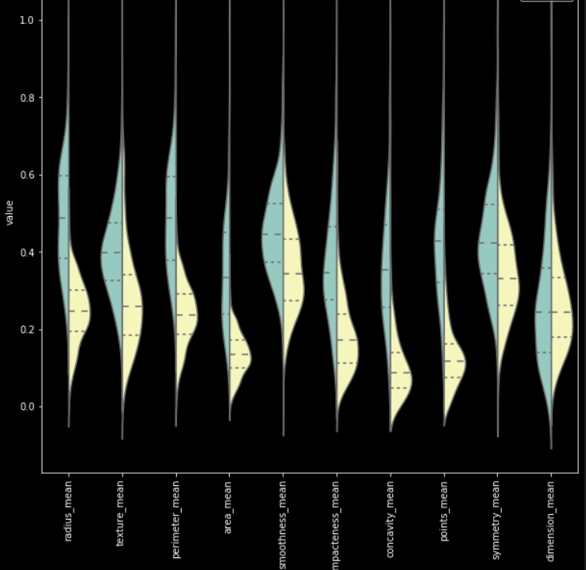
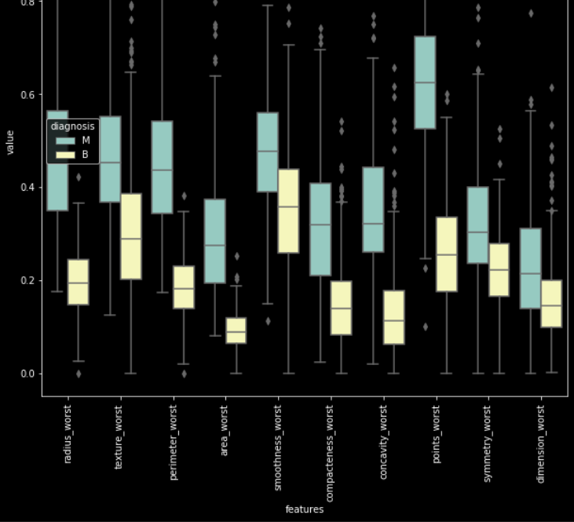
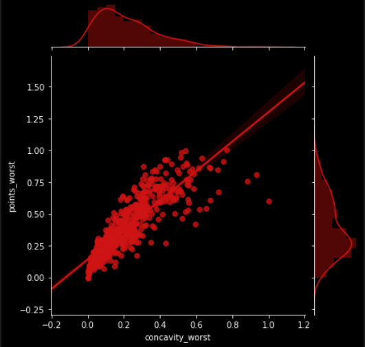
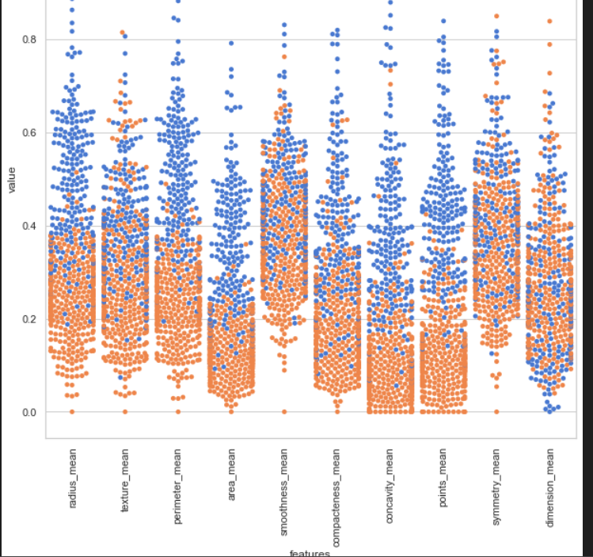
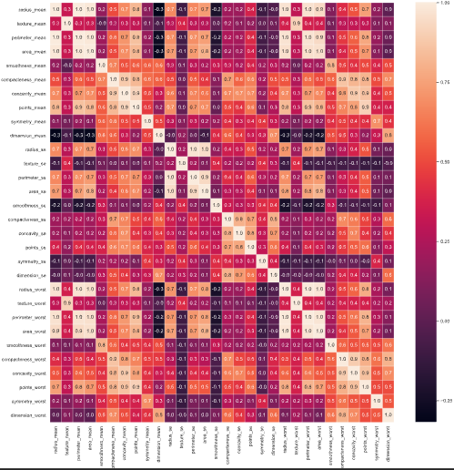
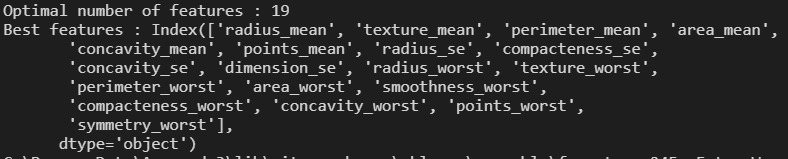
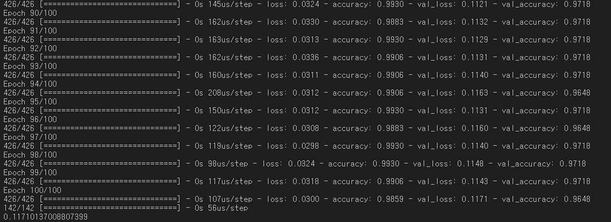

```python
import numpy as np
import pandas as pd
import matplotlib.pyplot as plt
import seaborn as sns # data visualization library
from scipy import stats
import time

from sklearn.tree import DecisionTreeClassifier
from sklearn.model_selection import train_test_split
from sklearn.preprocessing import MinMaxScaler
```

```python
data = pd.read_csv('./input/cancer.csv', delimiter= ',')
data.head
```
```python
x = data.iloc[:, 2:]
y = data.iloc[:, 1]

x_train, x_test, y_train, y_test = train_test_split(x, y, random_state=42)

scaler = MinMaxScaler()
x_train = scaler.fit_transform(x_train)
x_test = scaler.transform(x_test)

x.shape, y.shape 

```

**count plot을 이용해서 전체적인 y 라벨의 분표율 확인**
```python
ax = sns.countplot(y, label="Count")
B, M = y.value_counts()
print('Number of Benign: ',B)
print('Number of Malignant : ',M)
```


```python
x.describe()
```



**violin plot을 이용해서 각 컬럼의 값에 따라 y의 분포율 확인**
```python
scaler = MinMaxScaler()
x_scaled = scaler.fit_transform(x)
x = pd.DataFrame(x_scaled, columns=x.columns)


data = pd.concat([y, x.iloc[:, 0:10]], axis=1)
data = pd.melt(data,id_vars="diagnosis",
                    var_name="features",
                    value_name='value')
plt.figure(figsize=(10,10))
sns.violinplot(x="features", y="value", hue="diagnosis", data=data,split=True, inner="quart")
plt.xticks(rotation=90)


data = pd.concat([y, x.iloc[:, 10:20]], axis=1)
data = pd.melt(data,id_vars="diagnosis",
                    var_name="features",
                    value_name='value')
plt.figure(figsize=(10,10))
sns.violinplot(x="features", y="value", hue="diagnosis", data=data,split=True, inner="quart")
plt.xticks(rotation=90)


data = pd.concat([y, x.iloc[:, 20: ]], axis=1)
data = pd.melt(data,id_vars="diagnosis",
                    var_name="features",
                    value_name='value')
plt.figure(figsize=(10,10))
sns.violinplot(x="features", y="value", hue="diagnosis", data=data,split=True, inner="quart")
plt.xticks(rotation=90)
```


```python
plt.figure(figsize=(10,10))
sns.boxplot(x="features", y="value", hue="diagnosis", data=data)
plt.xticks(rotation=90)
```


**jointplot을 이용해 두 컬럼 유사도 확인**

```python
sns.jointplot(x.loc[:,'concavity_worst'], x.loc[:,'points_worst'], kind="regg", color="#ce1414")
```


**swarmplot을 이용해서 각 컬럼의 값에 따라 y의 분포율 명확히 확인**
```python
sns.set(style="whitegrid", palette="muted")
        # standardization
data = pd.concat([y,x.iloc[:,0:10]],axis=1)
data = pd.melt(data,id_vars="diagnosis",
                    var_name="features",
                    value_name='value')
plt.figure(figsize=(10,10))
tic = time.time()
sns.swarmplot(x="features", y="value", hue="diagnosis", data=data)

plt.xticks(rotation=90)
```



**heatmap을 이용해 각 컬럼의 유사도 확인**
```python
#correlation map
f,ax = plt.subplots(figsize=(18, 18))
sns.heatmap(x.corr(), annot=True, linewidths=.5, fmt= '.1f',ax=ax)
```


```python
from sklearn.feature_selection import RFECV
from sklearn.ensemble import RandomForestClassifier
from sklearn.metrics import f1_score,confusion_matrix
from sklearn.metrics import accuracy_score
from sklearn.ensemble import RandomForestClassifier

x_train = pd.DataFrame(x_train, columns=x.columns)
# The "accuracy" scoring is proportional to the number of correct classifications
clf_rf_4 = RandomForestClassifier() 
rfecv = RFECV(estimator=clf_rf_4, step=1, cv=5,scoring='accuracy')   #5-fold cross-validation
rfecv = rfecv.fit(x_train, y_train)

print('Optimal number of features :', rfecv.n_features_)
print('Best features :', x_train.columns[rfecv.support_])
```


```python
print(rfecv.support_)

x_train = pd.DataFrame(x_train, columns=x.columns)
x_test = pd.DataFrame(x_test, columns=x.columns)

data = x_train.iloc[:, rfecv.support_]
valid_data = x_test.iloc[:, rfecv.support_]


from sklearn.preprocessing import LabelEncoder

le = LabelEncoder()
le = le.fit(y_train)

y_train = le.transform(y_train)
y_test = le.transform(y_test)

```

```python
from keras.models import Model, Input
from keras.layers import Dense

shape = x_train.shape[1]
def build_model():
    model_input = Input(shape=(shape,))
    
    x = Dense(64, activation='relu')(model_input)
    x = Dense(8, activation='relu')(x)
    
    output = Dense(1, activation='sigmoid')(x)

    model = Model(model_input, output)

    model.compile(optimizer='adam', loss='binary_crossentropy', metrics=['accuracy'])

    return model

model = build_model()
model.fit(x_train, y_train, batch_size=32, epochs=100, validation_data=(x_test, y_test))

loss, _ = model.evaluate(x_test, y_test)

print(loss)


```

